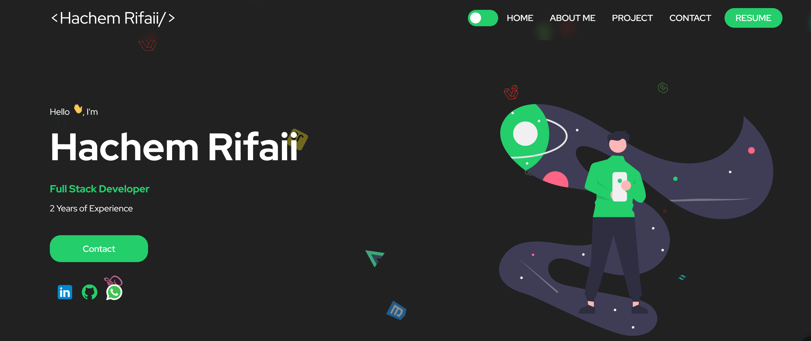

# 🚀 Portfolio of Hachem Rifaii  
🌐 **Live Demo**:

  

Welcome to my personal portfolio! 🎉 This website showcases my journey as a developer, highlighting my **skills**, **projects**, and **contact details** in an elegant and interactive way.

---

## 🛠️ Technologies Used  
- ⚛️ **React** – For building a dynamic user interface.  
- 🟦 **Typescript** – Ensures type safety for robust development.  
- 🎨 **Styled Components** – For writing maintainable, scoped CSS directly in JavaScript.  

---

## 📦 Getting Started  

Follow these steps to run the project locally:  
1. **Install dependencies**:  
   ```bash
   yarn install
